# BioForge AI | Agentic Drug Repurposing Prototype

Welcome to **BioForge AI**! 🧬

This is a working prototype built for the hackathon to demonstrate how **Autonomous AI Agents** can collaborate to solve complex problems in pharmaceutical drug discovery. 

Instead of a single "black box" model, we've built a **Multi-Agent System** where specialized AI workers tackle different parts of the drug repurposing pipeline and vote on the final outcome.

---

## 🏗️ Architecture: How It Works

The system is designed as a swarm of 4 independent agents. When you click "IGNITE AGENT SWARM", here is what happens under the hood:

```mermaid
graph TD
    User([User Input: Drug & Disease]) --> UI[Streamlit Interface]
    UI -->|Trigger Swarm| Lit[📚 Literature Agent]
    UI -->|Trigger Swarm| Pat[⚖️ Patent Agent]
    UI -->|Trigger Swarm| Clin[🏥 Clinical Agent]
    
    Lit -->|Relevance Score| Dec[🧠 Decision Agent]
    Pat -->|Risk Level| Dec
    Clin -->|Safety Score| Dec
    
    Dec -->|Synthesize Data| LLM{Gemini LLM}
    LLM -->|Final Report| UI
    
    subgraph "External Data Simulation"
        Lit -.-> PubMed((PubMed))
        Pat -.-> USPTO((USPTO))
        Clin -.-> FDA((OpenFDA))
    end
```




### 1. 📚 Literature Mining Agent from `agents/literature_agent.py`
*   **Role:** The Researcher
*   **Job:** Sims scanning millions of medical papers (PubMed, Nature, etc.).
*   **Logic:** It looks for semantic connections between your drug and the target disease. It outputs a "Relevance Score" and grabs simulated "Key Insights" from recent studies.

### 2. ⚖️ Patent Intelligence Agent from `agents/patent_agent.py`
*   **Role:** The Lawyer
*   **Job:** Checks if we are legally allowed to repurpose this drug.
*   **Logic:** Analyses patent expiry dates and litigation history. If a drug is still under a strict patent or currently being sued, this agent raises a red flag ("High Risk").

### 3. 🏥 Clinical Evaluation Agent from `agents/clinical_trial_agent.py`
*   **Role:** The Doctor
*   **Job:** Ensures the drug is safe for humans.
*   **Logic:** Looks at historical Phase 1/2/3 trial data. It calculates a "Safety Score" based on reported adverse events (side effects) from past trials.

### 4. 🧠 Decision & Report Agent from `agents/decision_agent.py`
*   **Role:** The Architect (Orchestrator)
*   **Job:** Makes the final call.
*   **Logic:** It takes the inputs from the other three agents and applies weighted logic.
    *   *Example:* Even if the literature support is amazing, if the Patent Agent says "High Risk", the Decision Agent will downgrade the final confidence score.
    *   It outputs a final **GO / NO-GO** recommendation.

---

## 🚀 How to Run locally

### Prerequisites
*   Python 3.8+ installed
*   Pip installed

### 1. Install Dependencies
Open your terminal/command prompt in this folder and run:
```bash
pip install -r requirements.txt
```

### 2. Configuration
1.  Create a `.env` file in the root directory (or copy `.env.example`).
2.  Add your Gemini API key:
    ```
    GEMINI_API_KEY=your_api_key_here
    ```


### 3. Launch the App
**Option A (Recommended for Windows):**
Simply double-click the `run_app.bat` file in this folder.

**Option B (Terminal):**
Run the following command:
```bash
python -m streamlit run app.py
```
*(Note: We use `python -m streamlit` instead of just `streamlit` to avoid common path issues on Windows)*

---

## 🛠️ Modifying the Agents
Want to tweak the logic? Go into the `agents/` folder.
*   **Make it stricter:** Edit `decision_agent.py` to penalize risks more heavily.
*   **Add more data:** Edit `literature_agent.py` to add new mock journals or insights.

Happy Hacking! 🚀
